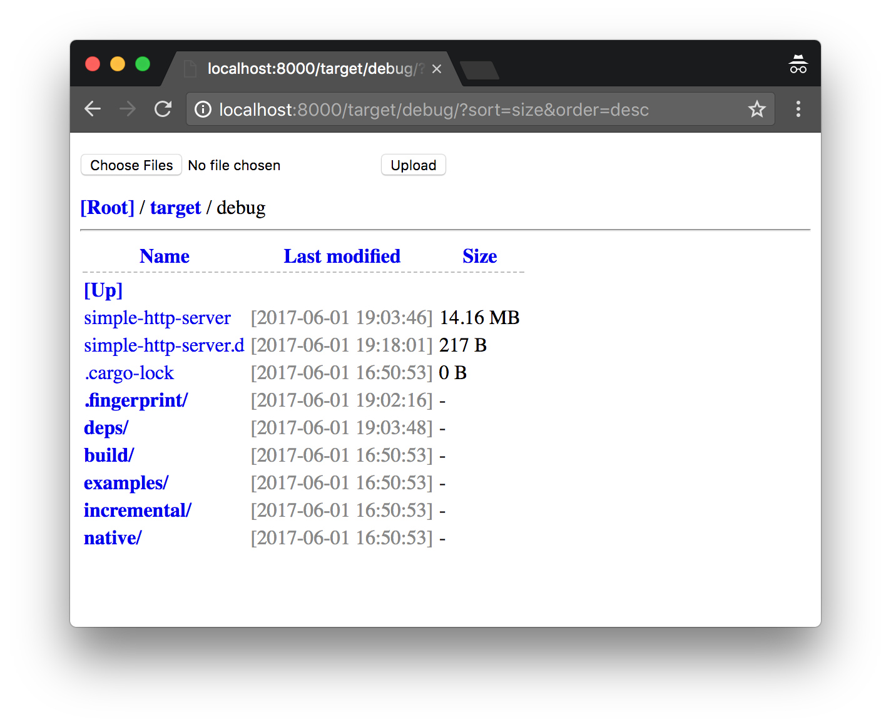

# How it looks like?

### Screenshot


### Command Line Arguments
```
Simple HTTP(s) Server 0.6.1

USAGE:
    simple-http-server [FLAGS] [OPTIONS] [--] [root]

FLAGS:
        --cors       Enable CORS via the "Access-Control-Allow-Origin" header
    -h, --help       Prints help information
    -i, --index      Enable automatic render index page [index.html, index.htm]
        --nocache    Disable http cache
        --norange    Disable header::Range support (partial request)
        --nosort     Disable directory entries sort (by: name, modified, size)
    -s, --silent     Disable all outputs
    -u, --upload     Enable upload files (multiple select) (CSRF token required)
    -V, --version    Prints version information

OPTIONS:
    -a, --auth <auth>                              HTTP Basic Auth (username:password)
        --cert <cert>                              TLS/SSL certificate (pkcs#12 format)
        --certpass <certpass>                      TLS/SSL certificate password
    -c, --compress <compress>...
            Enable file compression: gzip/deflate
                Example: -c=js,d.ts
                Note: disabled on partial request!
        --ip <ip>                                  IP address to bind [default: 0.0.0.0]
    -p, --port <port>                              Port number [default: 8000]
        --redirect <redirect>                      takes a URL to redirect to using HTTP 301 Moved Permanently
    -t, --threads <threads>                        How many worker threads [default: 3]
        --try-file <PATH>
            serve this file (server root relative) in place of missing files (useful for single page apps) [aliases:
            try-file-404]
    -l, --upload-size-limit <upload_size_limit>    Upload file size limit [bytes] [default: 8000000]


```

# Installation

### Download binary 
[Goto Download](https://github.com/TheWaWaR/simple-http-server/releases)

 - windows-64bit
 - osx-64bit
 - linux-64bit


### Install by cargo

``` bash
# Install Rust
curl https://sh.rustup.rs -sSf | sh

# Install simple-http-server
cargo install simple-http-server
rehash
simple-http-server -h
```

# Features
- [x] Windows support (with colored log)
- [x] Specify listen address (ip, port)
- [x] Specify running threads
- [x] Specify root directory
- [x] Pretty log
- [x] Nginx like directory view (directory entries, link, filesize, modfiled date)
- [x] Breadcrumb navigation
- [x] (default enabled) Guess mime type
- [x] (default enabled) HTTP cache control
  - Sending Last-Modified / ETag
  - Replying 304 to If-Modified-Since
- [x] (default enabled) Partial request
  - Accept-Ranges: bytes([ByteRangeSpec; length=1])
  - [Range, If-Range, If-Match] => [Content-Range, 206, 416]
- [x] (default disabled) Automatic render index page [index.html, index.htm]
- [x] (default disabled) Upload file
  - A CSRF token is generated when upload is enabled and must be sent as a parameter when uploading a file
- [x] (default disabled) HTTP Basic Authentication (by username:password)
- [x] Sort by: filename, filesize, modifled
- [x] HTTPS support
- [x] Content-Encoding: gzip/deflate
- [x] Added CORS headers support
- [x] Silent mode
