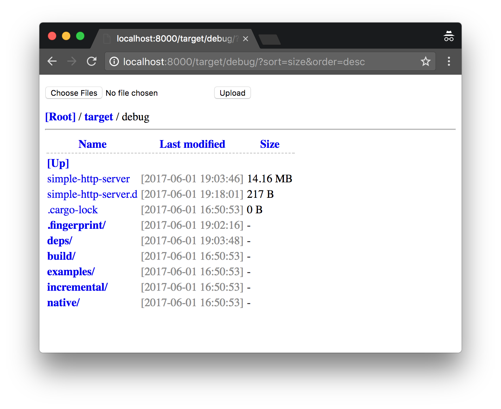

# Simple HTTP Server

Simple static file server with directory listing, upload, basic auth, range requests, compression, CORS, SPA fallback, and optional PKCS#12 HTTPS support.

The current implementation is based on `axum`/`tokio`. TLS support is behind the `tls` feature and is disabled by default so the default binary stays smaller.

## Screenshot



## Installation

Default build:

```sh
cargo install simple-http-server
```

With PKCS#12 HTTPS support:

```sh
cargo install simple-http-server --features tls
```

## Usage

```text
Usage: simple-http-server [OPTIONS] [root]

Arguments:
  [root]  Root directory

Options:
  -i, --index                     Enable automatic render index page [index.html, index.htm]
  -u, --upload                    Enable upload files. (multiple select) (CSRF token required)
      --csrf <TOKEN>              Use a custom CSRF token for upload. WARNING: this is dangerous as the token is passed via the command line and may be visible in process listings
      --redirect <URL>            takes a URL to redirect to using HTTP 301 Moved Permanently
      --nosort                    Disable directory entries sort (by: name, modified, size)
      --nocache                   Disable http cache
      --norange                   Disable header::Range support (partial request)
      --cert <FILE>               TLS/SSL certificate (pkcs#12 format, requires tls feature)
      --cors                      Enable CORS via the "Access-Control-Allow-Origin" header
      --coop                      Add "Cross-Origin-Opener-Policy" HTTP header and set it to "same-origin"
      --coep                      Add "Cross-Origin-Embedder-Policy" HTTP header and set it to "require-corp"
      --certpass <PASSWORD>       TLS/SSL certificate password (requires tls feature)
  -l, --upload-size-limit <SIZE>  Upload file size limit [bytes, or K/M/G/T suffix interpreted with powers of 1024, such as 30K, 50M, 1G] [default: 8M]
      --ip <IP>                   IP address to bind [default: 0.0.0.0]
  -p, --port <PORT>               Port number [default: 8000]
  -a, --auth <USER:PASS>          HTTP Basic Auth (username:password)
  -c, --compress <EXT>...         Enable file compression: gzip/deflate
                                  Example: -c=js,d.ts
                                  Note: disabled on partial request!
  -t, --threads <NUM>             How many worker threads [default: 3]
      --try-file <PATH>           Serve this file in place of missing paths. Relative paths are resolved against the server root; absolute paths are used as-is. [aliases: --try-file-404]
  -s, --silent                    Disable all outputs
  -o, --open                      Open the page in the default browser
  -b, --base-url <PATH>           Base URL prefix for directory indexes and upload redirects. It is normalized to start with '/' and to end with '/' when not root. [default: /]
  -h, --help                      Print help
  -V, --version                   Print version
```

## Examples

Serve a folder:

```sh
simple-http-server -i public
```

Enable upload and raise the upload limit:

```sh
simple-http-server -u -l 50M .
```

Serve an SPA fallback file:

```sh
simple-http-server --try-file dist/index.html dist
```

Run behind a reverse proxy that strips `/static/` before forwarding:

```sh
simple-http-server --base-url /static/ .
```

## HTTPS Example

`--cert` expects a PKCS#12 file such as `.p12` or `.pfx`. PEM files are not accepted directly.

### 1. Generate a local certificate and `.p12`

```sh
mkdir -p /tmp/simple-http-server-tls
cd /tmp/simple-http-server-tls

openssl req \
  -x509 \
  -newkey rsa:2048 \
  -nodes \
  -sha256 \
  -keyout key.pem \
  -out cert.pem \
  -days 7 \
  -subj "/CN=localhost" \
  -addext "subjectAltName=DNS:localhost"

openssl pkcs12 \
  -export \
  -inkey key.pem \
  -in cert.pem \
  -out localhost.p12 \
  -passout pass:changeit
```

### 2. Start the server

```sh
simple-http-server \
  -i \
  --ip 127.0.0.1 \
  --port 8443 \
  --cert /tmp/simple-http-server-tls/localhost.p12 \
  --certpass changeit \
  .
```

### 3. Verify it

Strict verification:

```sh
curl --fail --silent --show-error \
  --cacert /tmp/simple-http-server-tls/cert.pem \
  https://localhost:8443/
```

Quick local smoke test:

```sh
curl -kI https://localhost:8443/
```

## Features

- Directory listing with breadcrumb navigation
- Optional `index.html` / `index.htm` rendering
- File upload with CSRF protection
- HTTP Basic Auth
- HTTP cache control with `Last-Modified` and `ETag`
- Single-range partial content support
- `gzip` / `deflate` compression
- CORS plus `COOP` / `COEP` headers
- SPA fallback via `--try-file`
- Optional PKCS#12 HTTPS via the `tls` feature
